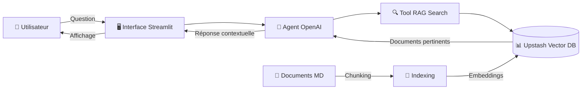

# 🚀 Portfolio LLM - Portfolio Interactif Intelligent

[](https://eferouxportfolio.streamlit.app/)
[](https://www.python.org/)
[](https://openai.com/)
[](https://upstash.com/)
[](LICENSE)

> Portfolio professionnel propulsé par l'Intelligence Artificielle utilisant un système RAG (Retrieval-Augmented Generation) pour répondre intelligemment aux questions sur mon parcours, mes compétences et mes projets.

## 🌟 Démo en Ligne

**🔗 [Accéder au Portfolio](https://eferouxportfolio.streamlit.app/)**

**📦 [Code Source](https://github.com/elliotfx/PortfolioLLM)**

---

## 📖 Table des Matières

- [Aperçu](#-aperçu)
- [Fonctionnalités](#-fonctionnalités)
- [Architecture](#-architecture)
- [Technologies](#️-technologies)
- [Installation](#-installation)
- [Utilisation](#-utilisation)
- [Structure du Projet](#-structure-du-projet)
- [Personnalisation](#-personnalisation)
- [Déploiement](#-déploiement)
- [Tests](#-tests)
- [Contribuer](#-contribuer)

---

## 🎯 Aperçu

Ce projet est un portfolio interactif nouvelle génération qui utilise l'intelligence artificielle pour créer une expérience conversationnelle. Au lieu d'un CV statique, les visiteurs peuvent poser des questions naturelles et recevoir des réponses personnalisées basées sur mon profil professionnel.

### ✨ Pourquoi ce projet ?

- **Interactivité** : Les recruteurs peuvent explorer mon profil de manière conversationnelle
- **Intelligence** : L'IA comprend le contexte et fournit des réponses pertinentes
- **Modernité** : Démontre mes compétences en IA, RAG et développement d'applications
- **Accessibilité** : Interface simple et intuitive, disponible 24/7

---

## 🔥 Fonctionnalités

| Fonctionnalité | Description |
|----------------|-------------|
| 💬 **Chat Interactif** | Interface conversationnelle fluide pour explorer le portfolio |
| 🔍 **Recherche Sémantique** | RAG avec Upstash Vector pour des réponses contextuelles précises |
| 🤖 **Agent IA Intelligent** | Propulsé par OpenAI Agents et GPT-4.1-nano |
| 📚 **Base de Connaissances** | Documents structurés en Markdown (profil, formations, expériences, projets, compétences) |
| 🎨 **Design Moderne** | Interface Streamlit avec thème sombre élégant |
| ⚡ **Performance** | Réponses rapides grâce à l'indexation vectorielle |
| 🔒 **Sécurité** | Gestion sécurisée des clés API via variables d'environnement |

---

## 🏗️ Architecture

Le projet utilise une architecture RAG (Retrieval-Augmented Generation) pour combiner la puissance des LLM avec une base de connaissances spécifique :



### 🔄 Flux de Traitement

1. **Indexation** : Les documents Markdown sont découpés en chunks et transformés en embeddings
2. **Stockage** : Les embeddings sont stockés dans Upstash Vector Database
3. **Requête** : L'utilisateur pose une question via l'interface Streamlit
4. **Recherche** : L'agent utilise le tool RAG pour chercher les documents pertinents
5. **Génération** : GPT-4.1-nano génère une réponse basée sur le contexte trouvé
6. **Affichage** : La réponse est présentée à l'utilisateur

---

## 🛠️ Technologies

### Core Stack

| Technologie | Version | Rôle |
|-------------|---------|------|
| **Python** | 3.12+ | Langage de programmation |
| **Streamlit** | 1.52.2 | Framework d'application web |
| **OpenAI Agents** | 0.6.5 | Framework d'agents IA |
| **Upstash Vector** | 0.8.0 | Base de données vectorielle |
| **GPT-4.1-nano** | Latest | Modèle de langage |

### Dépendances

```txt
streamlit==1.52.2
openai-agents[redis]==0.6.5
upstash-vector==0.8.0
pytest==9.0.2
python-dotenv==1.2.1
```

---

## 💻 Installation

### Prérequis

- Python 3.12 ou supérieur
- pip (gestionnaire de paquets Python)
- Git
- Compte OpenAI avec accès API
- Compte Upstash avec base de données vectorielle

### 1️⃣ Cloner le Repository

```bash
git clone https://github.com/elliotfx/PortfolioLLM.git
cd PortfolioLLM
```

### 2️⃣ Créer l'Environnement Virtuel

**Windows :**
```bash
python -m venv .venv
.venv\Scripts\activate
```

**Linux/Mac :**
```bash
python -m venv .venv
source .venv/bin/activate
```

### 3️⃣ Installer les Dépendances

```bash
pip install -r requirements.txt
```

### 4️⃣ Configurer les Variables d'Environnement

Créer un fichier `.env` à la racine du projet (utilisez `.env.example` comme modèle) :

```env
# OpenAI Configuration
OPENAI_API_KEY="sk-proj-..."

# Upstash Vector Database
UPSTASH_VECTOR_REST_URL="https://your-endpoint.upstash.io"
UPSTASH_VECTOR_REST_TOKEN="your-token-here"

# Optional: Streamlit Configuration
STREAMLIT_SERVER_PORT=8501
STREAMLIT_SERVER_ADDRESS=localhost
```

### 5️⃣ Vérifier l'Installation

```bash
pytest -s
```

Si tous les tests passent, l'installation est réussie ! ✅

---

## 🚀 Utilisation

### Indexation Initiale

Avant la première utilisation, indexez les documents dans Upstash Vector :

```bash
python -m src.indexing
```

Cette commande va :
- Lire tous les fichiers Markdown du dossier `data/`
- Découper les documents en chunks optimisés
- Générer les embeddings
- Les stocker dans Upstash Vector Database

### Lancement de l'Application

```bash
streamlit run app.py
```

L'application sera accessible sur **http://localhost:8501** 🌐

### Exemples de Questions

Voici quelques exemples de questions que vous pouvez poser à l'agent :

- "Quel est ton parcours académique ?"
- "Quelles sont tes compétences en data science ?"
- "Parle-moi de tes projets les plus intéressants"
- "Quelle est ton expérience professionnelle ?"
- "Quels outils et technologies maîtrises-tu ?"
- "Quels sont tes centres d'intérêt ?"

---

## 📁 Structure du Projet

```
LLMPortfolio/
├── .streamlit/              # Configuration Streamlit
│   └── config.toml         # Thème et paramètres de l'app
├── data/                    # 📚 Base de connaissances (Markdown)
│   ├── profil.md           # Présentation personnelle et contact
│   ├── formation.md        # Parcours académique et certifications
│   ├── experiences.md      # Stages, emplois et expériences pro
│   ├── projets.md          # Projets réalisés avec détails techniques
│   ├── competences.md      # Compétences techniques et outils
│   └── interets.md         # Centres d'intérêt et activités
├── src/                     # 🔧 Code source
│   ├── __init__.py
│   ├── chunking.py         # Découpage intelligent des documents
│   ├── indexing.py         # Indexation dans Upstash Vector
│   ├── tools.py            # Tool RAG pour la recherche sémantique
│   └── agent.py            # Configuration de l'agent OpenAI
├── tests/                   # 🧪 Tests automatisés
│   ├── test_chunking.py
│   ├── test_indexing.py
│   └── test_agent.py
├── .env.example             # Template des variables d'environnement
├── .gitignore              # Fichiers ignorés par Git
├── app.py                  # 🚀 Application Streamlit principale
├── requirements.txt        # Dépendances Python
├── README.md               # Ce fichier
└── RAPPORT_PROJET.md       # Documentation du projet
```

---

## 🎨 Personnalisation

### Modifier le Contenu

Pour adapter le portfolio à votre profil, éditez les fichiers Markdown dans `data/` :

#### 1. Profil Personnel (`data/profil.md`)
```markdown
# Profil

## Présentation
[Votre présentation]

## Contact
- Email: votre@email.com
- LinkedIn: linkedin.com/in/votre-profil
...
```

#### 2. Formation (`data/formation.md`)
Listez vos diplômes, certifications et formations.

#### 3. Expériences (`data/experiences.md`)
Détaillez vos stages, emplois et expériences professionnelles.

#### 4. Projets (`data/projets.md`)
Présentez vos projets avec contexte, technologies et résultats.

#### 5. Compétences (`data/competences.md`)
Organisez vos compétences par catégories (langages, frameworks, outils...).

#### 6. Intérêts (`data/interets.md`)
Partagez vos hobbies et centres d'intérêt.

### Réindexation

Après toute modification des fichiers Markdown, réindexez :

```bash
python -m src.indexing
```

### Personnaliser l'Interface

Modifiez `.streamlit/config.toml` pour personnaliser le thème :

```toml
[theme]
primaryColor = "#FF4B4B"
backgroundColor = "#0E1117"
secondaryBackgroundColor = "#262730"
textColor = "#FAFAFA"
font = "sans serif"
```

---

## 🌐 Déploiement

### Déploiement sur Streamlit Cloud (Recommandé)

1. **Push sur GitHub** :
   ```bash
   git add .
   git commit -m "Update portfolio"
   git push origin main
   ```

2. **Accéder à Streamlit Cloud** :
   - Aller sur [share.streamlit.io](https://share.streamlit.io)
   - Se connecter avec GitHub

3. **Déployer l'application** :
   - Sélectionner le repository `PortfolioLLM`
   - Choisir la branche `main`
   - Définir le fichier principal : `app.py`

4. **Configurer les Secrets** :
   - Dans les paramètres de l'app, ajouter les secrets :
   ```toml
   OPENAI_API_KEY = "sk-proj-..."
   UPSTASH_VECTOR_REST_URL = "https://..."
   UPSTASH_VECTOR_REST_TOKEN = "..."
   ```

5. **Déployer** 🚀

L'application sera disponible sur une URL comme `https://votre-app.streamlit.app/`

### Autres Options de Déploiement

- **Heroku** : Avec un `Procfile` et `setup.sh`
- **Docker** : Créer un `Dockerfile` pour conteneurisation
- **AWS/GCP/Azure** : Déploiement sur cloud providers
- **Vercel/Netlify** : Pour des versions statiques

---

## 🧪 Tests

Le projet inclut des tests automatisés pour garantir la qualité du code.

### Exécuter Tous les Tests

```bash
pytest
```

### Tests avec Détails

```bash
pytest -v -s
```

### Tests d'un Module Spécifique

```bash
pytest tests/test_chunking.py
pytest tests/test_indexing.py
pytest tests/test_agent.py
```

### Couverture de Code

```bash
pytest --cov=src --cov-report=html
```

---

## 🤝 Contribuer

Les contributions sont les bienvenues ! Si vous souhaitez améliorer ce projet :

1. **Fork** le projet
2. **Créer** une branche pour votre fonctionnalité (`git checkout -b feature/AmazingFeature`)
3. **Commit** vos changements (`git commit -m 'Add some AmazingFeature'`)
4. **Push** vers la branche (`git push origin feature/AmazingFeature`)
5. **Ouvrir** une Pull Request

---

## 📝 Licence

Ce projet est réalisé dans le cadre d'un projet universitaire et personnel.

---

## 👤 Auteur

**Elliot Feroux**

- Portfolio : [https://eferouxportfolio.streamlit.app/](https://eferouxportfolio.streamlit.app/)
- GitHub : [@elliotfx](https://github.com/elliotfx)

---

## 🙏 Remerciements

- **OpenAI** pour leur API et le framework Agents
- **Upstash** pour leur base de données vectorielle performante
- **Streamlit** pour leur framework intuitif
- **La communauté open-source** pour les outils et bibliothèques

---

<p align="center">
  <strong>Fait avec ❤️, ☕ et beaucoup de 🤖 IA</strong>
</p>

<p align="center">
  <a href="https://eferouxportfolio.streamlit.app/">
    
  </a>
</p>